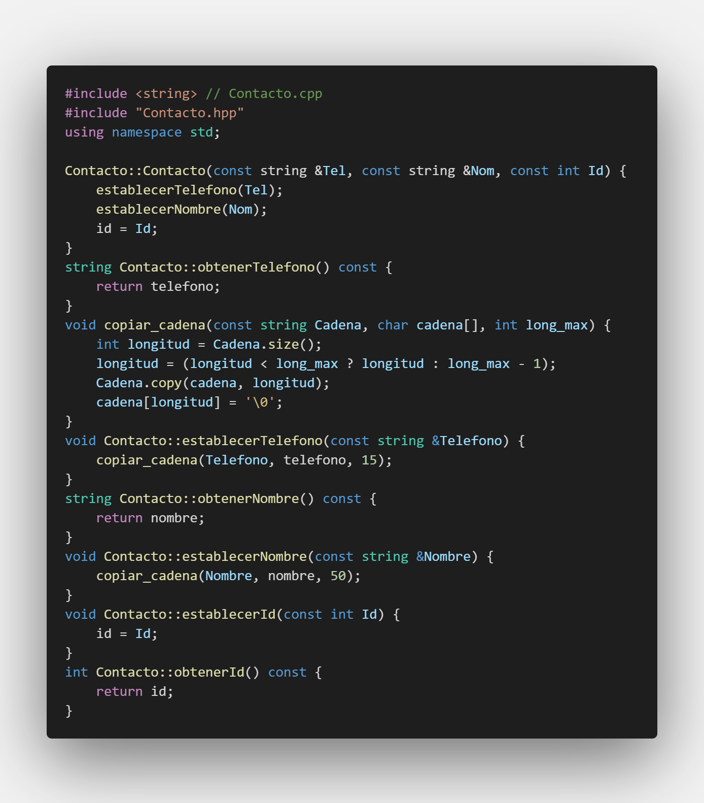

# C++ PDC_#09

## :copyright: Autor

- :camera: 

- :man: **Cesar Leonel Brito Flores**
- :e-mail: cesar.brito@unitec.edu
- :link: [(https://github.com/CesarLeonelBrito)](https://github.com/CesarLeonelBrito)
- :calendar: 
  - 2021-09-06 23:59 CST

---

# :camera: Programas & Salidas

---

## :globe_with_meridians: eof_get_y_put.cpp

### :file_folder: Código

### :open_file_folder: Salida

---

## :globe_with_meridians: cin_y_cin-get.cpp

### :file_folder: Código

### :open_file_folder: Salida

---

## :globe_with_meridians: cin-getline.cpp

### :file_folder: Código

### :open_file_folder: Salida

---

## :globe_with_meridians: read_y_write.cpp

### :file_folder: Código

### :open_file_folder: Salida

---

## :globe_with_meridians: dec_oct_hex_y_setbase-1.cpp

### :file_folder: Código

### :open_file_folder: Salida

---

## :globe_with_meridians: dec_oct_hex_y_setbase-2.cpp

### :file_folder: Código

### :open_file_folder: Salida

---

## :globe_with_meridians: cout-width.cpp

### :file_folder: Código

### :open_file_folder: Salida

---

## :globe_with_meridians: cout-setw-1.cpp

### :file_folder: Código

### :open_file_folder: Salida

---

## :globe_with_meridians: cout-setw-2.cpp

### :file_folder: Código

### :open_file_folder: Salida

---

## :globe_with_meridians: scientific_y_fixed.cpp

### :file_folder: Código

### :open_file_folder: Salida

---

## :globe_with_meridians: archivos_de_texto_escribir.cpp

### :file_folder: Código

### :open_file_folder: Salida

---

## :globe_with_meridians: archivos_de_texto_leer.cpp

### :file_folder: Código

### :open_file_folder: Salida

---

## :globe_with_meridians: archivos_binarios.cpp

### :file_folder: Código
#### :exclamation: main.cpp

#### :exclamation: Contacto.hpp

#### :exclamation: Contacto.cpp

#### :exclamation: acceso_aleatorio.hpp

#### :exclamation: acceso_aleatorio.cpp

### :open_file_folder: Salida

---
## :computer: Repositorio

- :link: [CPP_PDC_#09_#12041052_CesarBrito](https://github.com/CesarLeonelBrito/PDC_09_CesarBrito_12041052)

---
